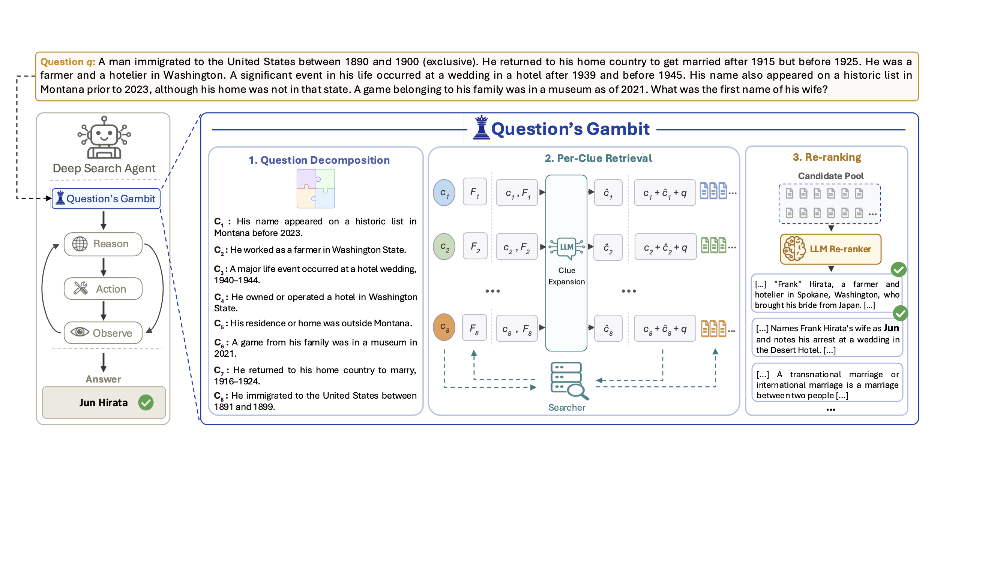

# Question-Gambit

Official implementation of Question's Gambit, a first-move retrieval module
for agentic deep search. The agent calls `first_move` as its opening action;
the module decomposes the question into clues, retrieves per clue, reranks the
merged pool against the question, and returns a top-k opening context. The
agent then continues with BM25 `search`, `read_search_results`, and
`read_document`.

---

## Architecture



*Figure 1: Overview of Question's Gambit. The module runs once as the agent's
first retrieval move, decomposing the question into clues, retrieving and
unioning per-clue results, reranking the candidate pool, and returning a
curated top-k opening context before the standard ReAct loop continues.
Checkmarks over the document snippets denote evidence documents, those
required to answer the question.*

---

## Repository Layout

```
src/
├── benchmarks/         # BrowseComp-Plus + MultiHop-RAG specs, registry
├── evaluation/         # judge prompt, parser, calibration, recall metrics
├── extensions/         # agent extension entry point
├── lib/                # shared helpers
├── orchestration/      # sharded BM25 server + per-query agent loop
├── pi-search/          # the agent-facing tools
│   ├── extension.ts            # tool registration: first_move, search,
│   │                           # read_search_results, read_document
│   ├── agent_prompt.ts         # agent prompt template
│   ├── constraint_decomp.ts    # clue decomposition
│   ├── clue_expansion.ts       # per-clue expansion (MUGI)
│   ├── cohere_rerank.ts        # Cohere Rerank 4 Pro over the pooled candidates
│   └── ...
├── runtime/            # process / agent runtime glue
├── search-providers/   # BM25 server client + process management
└── wrappers/           # entry points for evaluation and benchmarking

scripts/
├── run_arm.sh                  # run one arm end-to-end
├── judge_arm_concurrent.ts     # fixed judge, shared across arms
├── recall_against_qrels.ts     # recall panel
├── merge_benchmark_run_shards.py
├── split_query_tsv.py
├── generate_browsecomp_plus_query_slices.py
└── benchmarks/                 # data + index setup per benchmark
    ├── browsecomp_plus/
    └── multihoprag/

docs/
└── prompts.tex                 # every prompt used, verbatim
```

---

## Setup

### Prerequisites

| Tool | Version | Notes |
|---|---|---|
| Node.js | 22.x | `nvm install 22` |
| npm | 10.x | bundled with Node 22 |
| `tsx` | 4.20+ | installed via `npm install` |
| Python | 3.10+ | first-stage retrieval (Pyserini) and data preparation |
| Java | 21 (OpenJDK) | required by Pyserini's Lucene backend |
| `pi` CLI | 0.74+ | install via `npm install -g @earendil-works/pi-coding-agent` |
| `uv` | latest | used by the benchmark setup scripts |

### Install dependencies

```bash
git clone https://github.com/radinhamidi/Question-s-Gambit.git
cd Question-s-Gambit
npm install
pip install pyserini
```

### Benchmark data and index

Run the setup for each benchmark you intend to use. Each downloads the release,
builds the harness layout, indexes the corpus with Anserini, and writes the
baseline BM25 run.

```bash
# BrowseComp-Plus ground truth is encrypted and setup decrypts it in the same
# pass, so the canary published with the dataset must be set for this step.
BROWSECOMP_PLUS_CANARY=<canary> \
  bash scripts/benchmarks/browsecomp_plus/setup.sh

bash scripts/benchmarks/browsecomp_plus/generate_query_slices.sh

# The control benchmark. Run it after the BrowseComp-Plus setup, which is what
# fetches the Anserini jar into vendor/.
bash scripts/benchmarks/multihoprag/setup.sh
```

### API keys

Copy `.env.example` to `.env` and fill in the keys for the runs you intend
to reproduce:

```bash
cp .env.example .env
$EDITOR .env
```

| Variable | Used by |
|---|---|
| `OPENAI_API_KEY` | OpenAI agents, clue decomposition and expansion, judge |
| `OPENROUTER_API_KEY` | DeepSeek-V4-pro agent, Cohere Rerank 4 Pro |

## Quickstart: reproduce a single arm

Reproduce the gpt-5.5 main-result arm:

```bash
bash scripts/run_arm.sh
```

This runs end-to-end (Stage 1 agent benchmark → Stage 2 codex judge →
Stage 3 retrieval-only eval) and writes results to:

- `runs/pi_bm25_browsecomp-plus_qfull_qg_dx_gpt-4-1_openai_gpt-55_qg5_live_coherepro/`
- `evals/pi_judge_codex53/browsecomp-plus/<arm>/evaluation_summary.json`
- `evals/pi_judge_gold_codex53/browsecomp-plus/<arm>/recall_summary.json`

### Switching to a different agent model

```bash
# DeepSeek-V4-pro
AGENT_MODEL=openrouter/deepseek/deepseek-v4-pro bash scripts/run_arm.sh

# gpt-5.4-mini
AGENT_MODEL=openai/gpt-5.4-mini bash scripts/run_arm.sh
```

### Fixed configuration

These are constants in the source, not knobs, so the released system is the one that was
evaluated:

| | |
|---|---|
| clues per question | from one decomposition call by the agent model |
| feedback documents per clue | 3 |
| clue expansion | MuGI — 5 pseudo-documents, adaptive query repetition |
| expansion model | `gpt-4.1`, fixed across agents |
| per-clue retrieval depth | 1000 |
| reranker | Cohere Rerank 4 Pro, pointwise, over the deduplicated pool |
| opening context | top-5 |

### Knobs you can override at the command line

| Variable | Default | Description |
|---|---|---|
| `AGENT_MODEL` | `openai/gpt-5.5` | pi-coding-agent model id |
| `BENCHMARK` | `browsecomp-plus` | `browsecomp-plus \| multihoprag` |
| `QUERY_SET` | `qfull` | query slice; `mh200` for MultiHop-RAG |
| `SHARD_COUNT` | `16` | parallel agent shards |
| `TIMEOUT_SECONDS` | `900` | per-query agent wall-clock budget |
| `CODEX_JUDGE_CONCURRENCY` | `16` | concurrent judge calls |

---

## Reproducing all reported arms

```bash
for AGENT in \
  openai/gpt-5.5 \
  openai/gpt-5.4-mini \
  openrouter/deepseek/deepseek-v4-pro
do
  AGENT_MODEL=$AGENT bash scripts/run_arm.sh
done
```

Each arm takes 1–3h wall depending on agent model and machine.  Results
land in their own `runs/.../` and `evals/.../` directories keyed by the
agent model id.

The MultiHop-RAG control arms (two agents, 200 questions each):

```bash
for AGENT in openai/gpt-5.5 openai/gpt-5.4-mini
do
  BENCHMARK=multihoprag QUERY_SET=mh200 AGENT_MODEL=$AGENT bash scripts/run_arm.sh
done
```

---

## Prompts

Every prompt used by the system is listed verbatim in `docs/prompts.tex`.

## License

MIT — see `LICENSE`.  This work builds on the upstream
[`pi-serini`](https://github.com/justram/pi-serini) benchmark harness;
the upstream copyright is preserved in `LICENSE`.

---

## Citation

```bibtex
@misc{hamidirad2026questionsgambit,
  title         = {Question's Gambit: The First Move Matters in Agentic Deep Search},
  author        = {Hamidi Rad, Radin and Bigdeli, Amin and Arabzadeh, Negar and
                   Ebrahimi, Sajad and Clarke, Charles L. A. and Fung, Benjamin C. M. and
                   Bagheri, Ebrahim},
  year          = {2026},
  eprint        = {TODO},
  archivePrefix = {arXiv},
  primaryClass  = {cs.IR},
  url           = {https://arxiv.org/abs/TODO}
}
```
